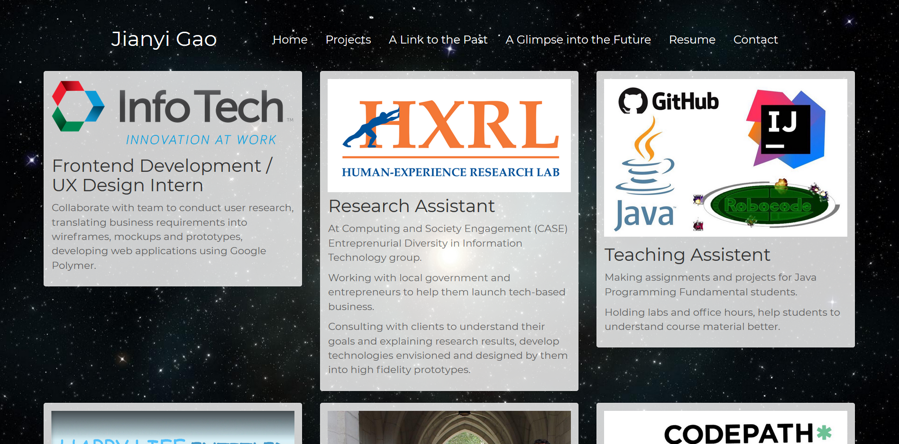

# Jianyi Gao's Web Page

This is [my personal webpage](https://jianyigao.github.io) with everything about me, my contact information and resume.

# Current version

Built with HTML5, CSS3 and Bootstrap.

# Preview
Homepage:

Projects:

A link to the past:

A glimpse into the future:

Contact:

More about me:

# What's more?

Constantly adding new stuff, constantly fixing new bugs.

## Acknowledgments

* Thanks to [Bootstrap](http://getbootstrap.com/), it adds so many colors to this web page!
* Hat tip to [Flaticon](https://www.flaticon.com/), they have countless beautiful icons, and they are free!
